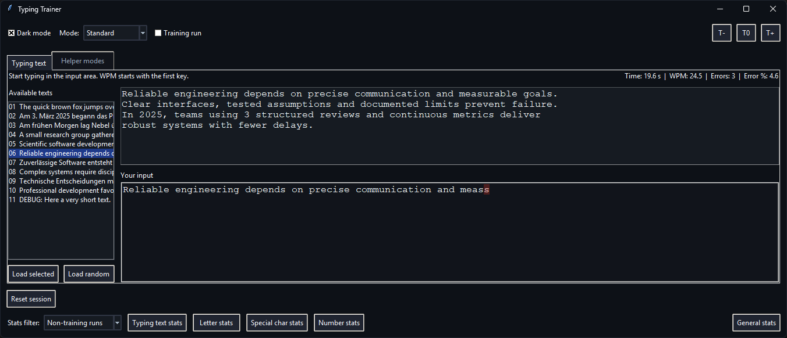
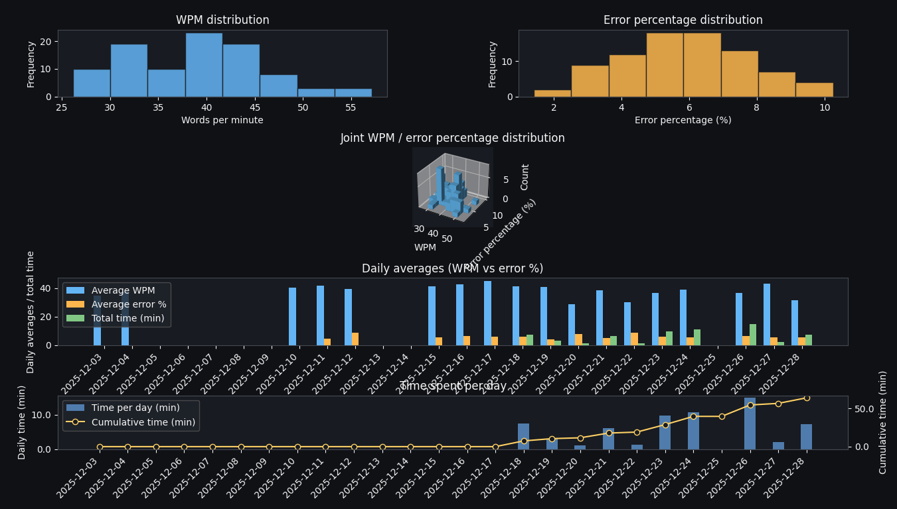

# Typing Practice

Typing Practice is a desktop typing trainer based on python that helps to practice fast typing full texts while tracking the speed and accuracy across multiple modes. Practice modes to learn only the typing of letters, numbers, and punctuation are beside the main mode. Statistics about the delivered performance to track the training progress are also included. 





Happy typing! Track your streaks, experiment with sudden-death challenges, and iterate on the data that the trainer collects for you.


## Highlights
- **Flexible drills**: Switch between classic text runs, focused letter/number/symbol exercises - All modes are also executable in sudden-death settings or blind mode settings
- **Live feedback**: Timer, WPM, accuracy, and error count update with every keystroke so you know when to reset or push harder
- **Persistent history**: Each run will be saved, enabling comparisons of training vs. benchmark sessions
- **Charts built in**: Launch histograms and trend charts to visualize streaks, recent days, or per-mode performance
- **Ergonomics**: Toggle dark mode, resize fonts, and pick from your curated text list


## Quick Start
1. Clone or download this repository
2. (Optional) Create and activate a virtual python environment
3. Install dependencies:
   ```powershell
   pip install -r requirements.txt
   ```
4. Launch the trainer:
   ```powershell
   python main.py
   ```


## Using the App
1. Setup the app (dark mode, mode, training run/benchmark, text size)
2. Select if typing text mode or one of the helper modes shall be conducted
3. (Typing text)
   1. Pick either a text from the left-hand list or load a random one
   2. Click the input pane or press `Tab` to focus it, then start typing the displayed text
   3. Watch the status bar for elapsed time, WPM, total errors, and running error percentage
   4. When the text matches perfectly, the run is logged and the summary freezes so you can reflect or immediately start another round
4. (Helper mode)
   1. Select which mode to conduct
   2. Write the displayed character up to the 100th letter - the mode is then finished
5. Filter the stats by training/benchmark/combined and have a look on  histograms, rolling trends, or per-mode breakdowns


## Training Modes
- **Typing (default)**: Full text practice pulled from `data/typing_texts.txt` (Users can provide their very own texts to write)
- **Letter / Special / Number drills**: Focused loops cycling through curated character sets
- **Sudden death**: Same drills but one mistake ends the session, logging how many perfect characters you managed
- **Blind mode**: Hides written text of the user and hides the live WPM/error readouts to learn to perfect the recognition when a key hit was wrong
- **Training run toggle**: Mark experiments separately; filters in the plotting UI treat the flag as its own dimension

Switch modes via the toolbar combobox and context buttons above the main panes.


## Data & Customization
- **Texts**: Edit `data/typing_texts.txt` to add or remove passages. Each line becomes one entry in the picker
- **Stats files**: The app auto-creates CSV logs such as `typing_stats.csv`, `letter_stats.csv`, and their sudden-death/blind variants. PLEASE DO NOT MAKE CHANGES ON THEM
- **Appearance**: Dark mode, font size buttons, and window resizing are persisted for the current session
