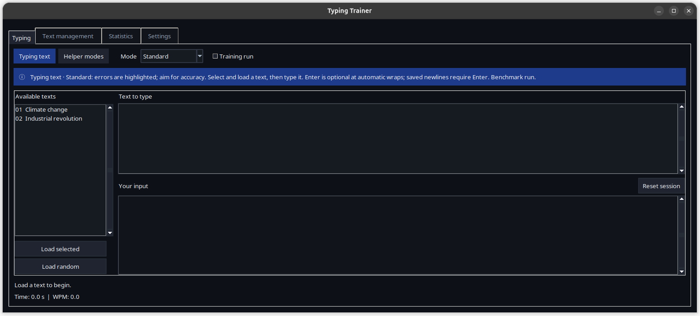
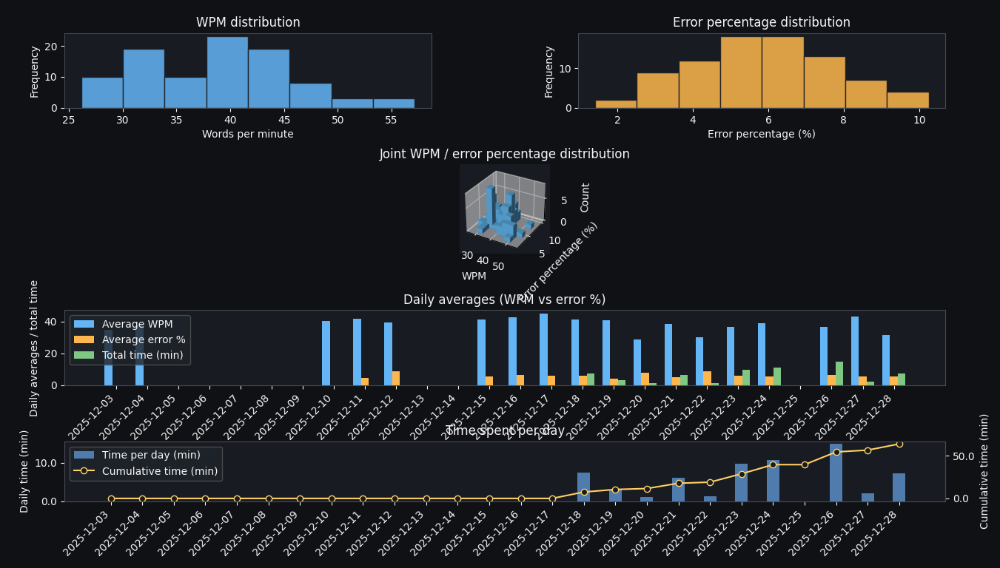

# Typing Practice

Typing Practice is a desktop typing trainer based on python that helps to practice fast typing full texts while tracking the speed and accuracy across multiple modes. Practice modes to learn only the typing of letters, numbers, and punctuation are beside the main mode. Statistics about the delivered performance to track the training progress are also included. 





Happy typing! Track your streaks, experiment with sudden-death challenges, and iterate on the data that the trainer collects for you.


## Highlights
- **Flexible drills**: Switch between classic text runs, focused letter/number/symbol exercises - All modes are also executable in sudden-death settings or blind mode settings
- **Live feedback**: Timer, WPM, accuracy, and error count update with every keystroke so you know when to reset or push harder
- **Persistent history**: Each run will be saved, enabling comparisons of training vs. benchmark sessions
- **Charts built in**: Launch histograms and trend charts to visualize streaks, recent days, or per-mode performance
- **Ergonomics**: Follow the system theme or choose Light/Dark, resize fonts, and manage named texts


## Quick Start
1. Clone or download this repository
2. (Optional) Create and activate a virtual python environment
3. Install dependencies:
   ```powershell
   pip install -r requirements.txt
   ```
4. Launch the trainer:
   ```powershell
   python main.py
   ```


## Using the App
1. Open the last tab, **Settings**, for Theme, Practice text size, and UI text size. UI text scales labels, buttons, tabs, pickers and list names, and is saved separately from the practice font.
2. Open **Typing** and choose **Typing text** or **Helper modes**. Mode and Training run sit alongside these choices. The highlighted information box explains the current drill and Standard/Sudden death/Blind behavior. Reset session sits directly above each input pane.
3. (Typing text)
   1. Click a text in the left-hand list to load it immediately, or load a random one. Clicking another text resets the current run.
   2. Click the input pane or press `Tab` to focus it, then start typing the displayed text
   3. Watch the status bar for elapsed time, WPM, total errors, and running error percentage
   4. When the text matches perfectly, the run is logged, input becomes read-only (copying remains possible), and the summary freezes so you can reflect or immediately start another round
4. (Helper mode)
   1. Select which mode to conduct
   2. Write the displayed character up to the 100th letter - the mode is then finished
5. Open **Statistics** to choose a chart mode and filter training/benchmark/all runs. Open a mode-specific chart or the Overview for trends across all modes. These chart controls are independent of practice controls; the page scrolls when needed.


## Training Modes
- **Typing (default)**: Full text practice from your encrypted, ordered text library. Add your first text in **Text management**.
- **Letter / Special / Number drills**: Focused loops cycling through curated character sets
- **Sudden death**: Same drills but one mistake ends the session, logging how many perfect characters you managed
- **Blind mode**: Hides written text of the user and hides the live WPM/error readouts to learn to perfect the recognition when a key hit was wrong
- **Training run toggle**: Mark experiments separately; filters in the plotting UI treat the flag as its own dimension

Switch practice type, sub-mode and the training flag in the Typing tab. Letters, Characters and Numbers are available under Helper modes.


## Data & Customization
- **Generate a temporary text**: Next to **Load random**, choose English or German (German is the default) and click **Generate text**. The app starts LM Studio’s headless service and local server on `127.0.0.1:1234`, then loads the downloaded **gpt-oss-20b** model only on demand. It reuses an already loaded instance and leaves the service/model running when the app closes. There is no automatic model download or fallback. The normal `python main.py` launch is sufficient; no wrapper script or extra Python dependency is needed.
- **Generated passages**: Each request starts a fresh, stateless conversation and asks for a natural paragraph about a random topic in the selected language. Results must contain 350–450 characters including spaces and punctuation; up to two length revisions are allowed rather than cutting sentences. Text remains only in memory, outside the library and coverage counts. Run statistics are saved normally. **Reset session** or changing the practice mode requests a new passage; switching to helper modes discards the generated passage. Each generated passage is for one run, with the completed input locked for review. Selecting a saved text while generation is pending discards the late response. Loading status appears in the practice status area; the app stays responsive. The generation language is saved in Settings. If generation fails, the current passage remains visible; click **Generate text** to retry.
- **Text languages**: Each text has a required language field. Choose **English** or **German** from the dropdown. **-** means no language is assigned and keeps the text marked **Language required**. Existing texts remain readable and are marked **Language required** until assigned; saving the library requires a language for every text. Languages are stored for future evaluation and do not filter character coverage.
- **Keyboard layout**: Settings offers German QWERTZ (default), US QWERTY, UK QWERTY and a custom character set. Presets include letters, digits, symbols, spaces, tabs and newlines. Custom sets can contain any characters, with duplicates removed. Click **Apply custom characters** to save custom edits. Letters, Characters (punctuation/symbols), and Numbers remain separate drills using their category from the selected layout. Running drills retain their original set; new drills use the changed layout. Single-character custom categories allow repetition, and empty categories explain why a drill cannot start.
- **Character coverage**: In Text management, click **Character coverage** to open a sortable table of counts across all saved texts, regardless of language. Only characters from the selected keyboard layout appear, including zero-count characters. Uppercase/lowercase and whitespace count separately; Unicode codes identify each character. The default threshold is 10: only counts strictly below the threshold appear. Enter a non-negative whole number and click **Apply** to save it. Unsaved text-manager edits are excluded; saving texts or changing layouts refreshes an open table.
- **Completed runs**: Input locks after completion or sudden-death failure in every practice mode. Use **Reset session**, click a text, load a random text, or start a helper drill to begin again.
- **Texts**: Open the **Text management** tab to add named passages, edit or paste their content, delete with confirmation, and reorder by dragging or using Move up/down. Click **Save changes** to persist the library and update the main selection list. Switching tabs keeps unsaved drafts. Discard changes restores the last saved library, and closing the app prompts to save or discard edits. A run already loaded keeps its original text until you load another one.
- **Length goal**: The text manager suggests 400 characters and shows how many characters your text is below or above that goal. This is a suggestion, not a limit; spaces and actual newlines count as characters.
- **Whitespace**: The editor and preview wrap long lines automatically without inserting newline characters. Only line breaks already in the text (including those added with Enter) need to be typed during practice. The editor preserves the exact text, including trailing spaces, tabs and blank lines. Its live preview uses `·` for spaces, `⇥` for tabs, `↵` for newlines and explicit Unicode labels for other invisible characters. Preview symbols are never saved into your text. Typing practice uses the original saved content without adding line breaks or removing spaces.
- **Enter during practice**: At automatic wraps in the practice target, you can keep typing normally or press Enter. Between words, Enter may replace the separating space or accompany it. Optional Enter presses do not count as errors or extra characters/words. Actual newlines and blank lines saved in the text remain required. Accepted wrap points are captured when the exercise starts and stay fixed until reset or reload; if you resize or change the font during a run, reset to use its new wrap points.
- **Appearance**: **System** is the default and follows OS appearance changes while the app is open (within a few seconds). **Light** and **Dark** override it. System detection supports Windows, macOS, and Linux via the desktop settings portal with GNOME fallback; unavailable preferences default to light. Practice text size, UI text size, theme preference, keyboard layout, custom characters, coverage threshold and main window dimensions persist in `settings.json`. Window position, selected text, training options and unfinished runs are not restored.
- **Storage**: User data lives in the project’s Git-ignored `data/` folder, independent of the launch directory. `data/settings.json` stores appearance and window settings, `data/texts.json.enc` stores named texts, `data/*_stats.csv.enc` stores statistics, and `data/storage.key` unlocks the encrypted files. Keep the key together with your encrypted files when backing up or moving the project.
- **Encryption**: Texts and all regular, training, sudden-death and blind-mode statistics use authenticated [Fernet encryption](https://cryptography.io/en/latest/fernet/). Files use `.enc` extensions, and CSV statistics are decrypted only in memory for charts. Settings are plain JSON. Writes use atomic replacement. Modified encrypted files produce an error rather than silently resetting their contents.
- **Automatic unlocking**: No password is needed. A local `storage.key` unlocks the data; on Unix the key and data files are created with owner-only permissions. This deters casual editing rather than someone who can read the key and run their own code. Back up the entire data folder, including the key; losing the key makes encrypted data unreadable.
- **Git**: The entire `data/` folder, encrypted files, settings and local keys are ignored. User data stays local to the project and is not committed.

## Verification
Run the storage, theme and GUI regression tests without using your desktop:
```bash
xvfb-run -a -s '-screen 0 1920x1080x24' env -u WAYLAND_DISPLAY TYPING_PRACTICE_TEST_DISPLAY=isolated .venv/bin/python -m unittest discover -s tests -v
```
The tests use temporary user-data folders, mocked system appearance detection and an isolated display.
